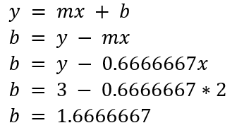
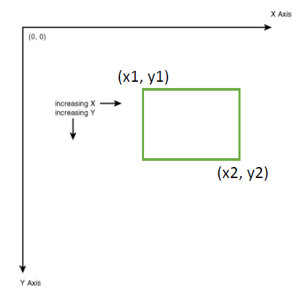

> **Note:** It will take 2-5 minutes for the points to update after you push.

## Be sure to read the assignment carefully

## Deliverables

| Deliverable          | Points    |
| -------------------- | --------: |
| Constructor tests	   | 12 points |
| Save/Load tests      | 10 points |
| Getter/Setter tests  | 5 points  |
| DrawPixel tests      | 5 points  |
| DrawLine test        | 10 points |
| DrawRectangle test   | 8 points  |
| Commenting           | 10 points |
| Commits              | 10 points |


### Commenting
You should
* Add pre and post conditions in the manner described in Assignment 0.
* The pre and post condition comments should be at minimum in the header file.
* Add comments in the implementation where appropriate.

### Commits
* Reasonable commits should be made during the development
  (Consider committing after implementing a function or passing a test)
* "Comment Messages" for the commits that describe the commit. It doesn’t
  have to be long.  Just a few short statements per file commit is fine.
* Commit comments made on a per file basis rather than making the same
  comment on a group of files (Make commits one file at a time so each can
  have its own comment).
* Files generated by the IDE (.idea, cmake-build-debug, etc) should NOT be
  added or tracked by the repository. If you add them by accident, just
  delete them.


## Be sure the run configurations are correct
Make sure each run configurations should use $PROJECT_DIR$ for the working directory. 
Please refer to the guide on Canvas for more details.

The following executables should be setup using the "Catch" template:

- ImageMaker_Test
- Getter_Setter_Test
- Constructor_Test
- Save_Load_Test
- DrawPixel_Test
- DrawRectangle_Test
- DrawLine_Test

The following executables should be setup using the "CMake Application" template:

- ImageMaker_driver


## ImageMaker_driver.cpp

This file does not require any additional code to be added for submission.
Use it purely as an example to see some example usage how ImageMaker class
is used. This file will NOT be used for grading.

You are welcome to change or add code and it for debugging.

## Grading Unit Tests

The unit_tests folder contains all the tests we will use for grading.
These files are complete and do not require any additional code.
Your responsibility is to make sure that all the tests pass to receive
full marks for functionality.

### The following are the files used for grading:

- constructor_tests.cpp
- save_load_tests.cpp
- getter_setter_tests.cpp
- DrawPixel_tests.cpp
- DrawRectangle_tests.cpp

> **WARNING:** *DO NOT CHANGE THESE TEST FILES*

If you want to make your own additional tests, you may make them in my_tests.cpp
or in the ImageMaker_driver.cpp file.

## IMPORTANT!!! - Test Dependencies

Some tests require certain functions to be implemented before the test will 
work correctly.  For example, the Constructor test will not pass 
until `SaveImage` is implemented.

The easiest way to determine what is required is to look at the test files. 
If we open the `constructor_tests.cpp` file in the `unit_tests` folder we 
can see exactly what functions the test uses:


We can see that the default constructor test requires the following 
functions to be implemented:
* `GetHeight()`
* `GetWidth()`
* `GetPenRed(int)`
* `GetPenGreen(int)`
* `GetPenBlue(int)`
* `SetWidth(int)`
* `SetHeight(int)`
* `SaveImage(string)`

## images and test_images

These folders contain images used or generated by the unit tests.  The folder images holds
images used by the unit tests (DO NOT CHANGE THESE!).  The folder test_images holds images
generated by the unit test (this folder will start empty).

> **WARNING:** *DO NOT CHANGE FILES IN THE "images" FOLDER*

## Recommended Implementation Order

The following is the recommended implementation order:

| Function |
| -------- |
| `ImageMaker()` |
| `Getters/Setters` |
| `void LoadImage(string filename)` |
| `ImageMaker(string filename)` |
| `SaveImage(string filename)` |
| `DrawPixel(int x, int y)` |
| `DrawLine(int x1, int y1, int x2, int y2)` |
| `void DrawRectangle(int x1, int y1, int x2, int y2)` |

# Assignment Introduction

Most CS students should be familiar with image formats such as gif, jpg, bmp,
etc.  One simple but not often used image format is a ppm (portable pix map).
In this assignment, you will make a class called ImageMaker that can create,
load, save, and draw ppm images using basic drawing methods.  In addition,
you will make a driver that can be used to help test the functionality of
the class.  The following is the class definition:

```c++
const int MAX_WIDTH = 800;
const int MAX_HEIGHT = 800;
const int MAX_COLOR = 255;
enum COLOR { RED, GREEN, BLUE };

using namespace std;

//  Please put your pre and post comments in this file. 
//  See page 139 in the textbook.

class ImageMaker
{
public:
    ImageMaker();
    ImageMaker(string filename);

    // Opens image with filename and stores information into
    void LoadImage(string filename);
    void SaveImage(string filename);

    // Size functions
    int GetWidth();
    int GetHeight();
    void SetWidth(int width);
    void SetHeight(int height);

    // Color functions
    int GetPenRed();
    int GetPenGreen();
    int GetPenBlue();
    void SetPenRed(int newR);
    void SetPenGreen(int newG);
    void SetPenBlue(int newB);

    // Drawing methods
    // These methods will use the current red, green, blue values of the pen
    void DrawPixel(int x, int y);
    void DrawRectangle(int x1, int y1, int x2, int y2);
    void DrawLine(int x1, int y1, int x2, int y2);

private:
    int width;
    int height;
    int pen_red;    // Used by draw functions
    int pen_green;  // Used by draw functions
    int pen_blue;   // Used by draw functions
    bool PointInBounds(int x, int y);
    short image[MAX_WIDTH][MAX_HEIGHT][3];
};
```

## Example of Class Usage
Lets start by looking at a couple of examples of ImageMaker usage.  The
following code draws a simple house and saves it to a file (the image is
produces is to the right):


The library is also able to load existing images and modify them using the
drawing functions.  Here is an example that loads an existing image called
"cake.ppm", modifies it, and saves the result to a new ppm:


## Portable Pix Map Image Format Specification (PPM)
Image files store red, green and blue values for each pixel of an image.  If
you are unfamiliar with RGB images, you can watch
[this short video](https://www.youtube.com/watch?v=15aqFQQVBWU).  The
portable pix map image format (ppm) is one of the simplest methods of
creating an image file.  This format is encoded as readable ascii text or
viewed as an image with an image viewing program such as gimp or IrfanView
(https://www.irfanview.com/).  If you use a PC, I recommend that you use
IrfanView in order to view ppm images.  If you have Mac or linux, you should
be able to view ppm images just by clicking on the ppm file.

Read the following wiki-link for additional details:
https://en.wikipedia.org/wiki/Netpbm_format

Here is a sample of what a ppm image looks like in notepad and the
corresponding image in an image viewer:


## The ppm header

The ppm file is divided into a header and a body.


The header in our sample file contains four values:

```
P3
4 4
255
```

In this example, we show the header values on three separate lines; however,
it is also acceptable to have the header values all on a single line.

## Header: Magic Number

The first field (here, with the value P3) is called a "magic number".  This defines what type of image is being represented:

| **Magic Number** | **Image Type**  |
|----------------- | --------------- |
| P1               | Black and White |
| P2               | Grayscale       |
| P3               | Color           |

More precisely, the magic number tells the computer that the file is a
picture where each pixel has three values (a red value, a green value, and a
blue value).  The value "P1" would produce a picture with only black and
white pixels (no shades of gray at all).  If you wanted to create a
grayscale image, you would use the value "P2".

"P3" indicates that the image will use RGB color.

## Header: Specify width and height
The second line indicates width and height.  In this example, the image has
a width of 4 and a height of 4.  The "4 4" tells the computer that the
picture is 4 pixels wide and 4 pixels high.

## Header: Maximum value scale

The last 255 value tells the computer that the maximum pixel value for red,
green, or blue is 255.  We will talk more about this value in the next section.

## Body

After the image header is the body.  These values provide values of each
pixel in the image:


Notice there are four rows of data.  This is because the height of the
picture is 4. However, when we look at each row, we see there are twelve
values.  This is because each group of three values corresponds to a single
pixel value:


Here, we see that the last group of pixels in the first row has the values
(155, 0, 155), which corresponds to a purple color.  This is where the 255
max value scale we mentioned earlier is used.  A value of 255 means the
maximum amount of color is used.  If we look at the first group of values (0,
0, 0) in the first row, we see that the color is black.  This is because
there is no red, green, or blue color in the pixel.  If we look at the
second pixel of the first row, we have the value (200, 0, 0), which is a
mostly red pixel.  If we look at the first pixel of the last row we see a
value of (255, 255, 255).  This is maximum amount of color for red, green,
and blue, which produces the color white.

## A note about white space

In all the examples we have given, the ppm files have been formatted nicely
to allow for easy reading.  However, the file does NOT need to be formatted
nicely for image readers to understand the image.  For example, the ppm
example we gave could also be formatted as follows and the image reader
would still read it happily:


To simplify things, we do NOT require the ppm files you generate to be
formatted. It is acceptable to generate ppm files that are a single line.  
However, you may find it easier to debug your program if you do keep
formatting in mind.

## Private Variables

The private variables for this class contain all the information required to
store a ppm image and to draw on this image.

| Private Variable | Description |
| ---------------- | ----------- |
| width		| Stores the image width.  It between 0 and MAX_WIDTH inclusive. |
| height	| Stores the image height.  It between 0 and MAX_HEIGHT inclusive. |
| pen_red	| This is how much red will be used when using one of the draw functions. |
| pen_green	| This is how much green will be used when using one of the draw functions. |
| pen_blue	| This is how much blue will be used when using one of the draw functions. |
| image	| This is a three dimensional matrix that will store the RGB values of the image|

**All pen colors should be between 0 and MAX_COLOR inclusive.**

## ```short image[MAX_WIDTH][MAX_HEIGHT][3]```
It is important to understand how the image matrix works.  In this section
we will do some examples that should give you enough information to color
pixels needed for the draw functions.  Each pixel location is represented by
an (x, y) coordinate and each of these coordinates has three values.  This
means the data can be represented as a three-dimensional matrix.  Below is
how one could visualize the matrix.

```c++
image[0][2][0] = 155;
image[0][2][1] = 0;
image[0][2][2] = 155;
```


Suppose we want to set the pixel (0, 2) to purple.  Purple has the RGB value
of roughly (155, 0, 155). To set the color of a pixel at (0, 2) to purple,
we could use the following code:

```c++
image[0][2][0] = 155;
image[0][2][1] = 0;
image[0][2][2] = 155;
```


While this code works, it is not considered very good style.  It may take a
bit of time for someone reading the code to figure out that this code is
setting a pixel color.  Instead, we can write the code using our enumerated
color variable we defined:

```c++
image[0][2][RED] = 155;
image[0][2][GREEN] = 0;
image[0][2][BLUE] = 155;
```

> **HINT:** The example is very close to what you need for "DrawPixel"

## Dealing with Bad Values
There are situations where the user may put bad data into functions.  We
will handle these using a C++ function called "throw".  We will learn much
more about "throwing errors" later in the course.  For now, we will use them
in a very basic way.  For example, suppose the user inputs a negative value
for the width:

```c++
ImageMaker img;
img.SetWidth(-100);
```

We want to tell the user that they didn’t use the function properly.  To do
this, we will utilize a "throw" in the function.

```c++
if (newWidth < 0 || newWidth > MAX_WIDTH) {
    throw "Width out of bounds";
}
```

If the user inputs a negative value, then function will return the message
"Width out of bounds" to our testing framework.

## Constructors

There are two constructors. The default constructor should create an image
with 0 width and 0 height, and set the initial pen color to black (0, 0, 0).
The "image" variable should be initialized to be white (i.e. set every value
in the variable "image" to 255).

The second constructor should initialize the variable "image" to be white,
load a ppm image into the image matrix and set the private variables
accordingly. The default pen color should be set to black.  The constructor
should handle basic error checking.  It is required to handle the following:

* If the file fails to open, then it should throw "File failed to open"
* If the magic number is not "P3", it should throw the string "Bad magic
  number"
* If the width is out of bounds, you should throw the string "Width out of
  bounds"
* If the height is out of bounds, you should throw the string "Height out
  of bounds"
* If the maximum color value is not 255, you should throw the string "Max
  color range not 255"
* If one of the pixels has a bad value, then you should throw the string
  "Color value invalid"

If you do not throw exactly these strings, then several of the tests will
fail to pass.

> **Hint:** There may be a function that does a lot of the work for this
> constructor already.

## LoadImage

Load image opens an existing ppm image file and stores the image data into
the "image" private variable, the width variable, and the height variable.  
This allows us to draw on to existing images.  For example:

```c++
ImageMaker img;
img.LoadImage("cake.ppm"); // Load existing cake image.

// Set pen to red
img.SetPenRed(255);  // Max red color
img.SetPenGreen(0);  // No green
img.SetPenBlue(0);   // No blue

img.DrawPixel(5, 5);       // Draw a red pixel at (5, 5)
img.SaveImage("cake_with_dot.ppm"); // Save the image
```

This function should have some basic error checking.  It is required to handle the following:
*	If the file fails to open, then it should throw "File failed to open"
*	If the magic number is not "P3", it should throw the string "Bad magic number"
*	If the width is out of bounds, you should throw the string "Width out of bounds"
*	If the height is out of bounds, you should throw the string "Height out of bounds"
*	If the maximum color value is not 255, you should throw the string "Max color range not 255"
*	If one of the pixels has a bad value, then you should throw the string "Color value invalid"

**If you do not throw exactly these strings, then several of the tests will
fail to pass.**

> **HINT:**
> You will need a nested for loop to read all the pixels from the file.
> 
> **SUPER HINT:** For each row, read all of the columns.  Be careful 
> converting between (rows, column) and (x, y).
> ```c++
> // For each x, y coordinate
> for(...) {
>    for(...) {
>       read red value from file
>       read green value from file
>       read blue value from file
> 
>       Set the pixel color at x,y using the three values
>       just read from the file 
>    }
> }
> ```

## SaveImage

This function constructs a ppm image using the private variables image,
width, and height and saves it to the given filename.  You may assume that
the max color is always 255 and that the magic number is always P3.  This
function should:

1.	Open an ofstream object using filename
2.	Write the header information
3.	Write out the RGB values from the private variable "image"
4.	Throw "Image must have non-zero dimensions" if width or height is 0

## Size Functions

The size functions are basically getters and setters.  While simple they should do basic error checking.
*	SetWidth should only accept values between 0 and MAX_WIDTH inclusive.  
     If a bad value is given, then you should throw "Width out of bounds"
*	SetHeight should only accept values between 0 and MAX_HEIGHT inclusive.  
     If a bad value is given, then you should throw "Height out of bounds"

## Color Functions

Similar to the size setter function, the pen setters should have basic error
checking.  If a color value is negative or larger than 255, then the
function should throw "Color value invalid".

## Draw Functions

All draw functions should throw an error if out of bounds values are given.  
All draw functions use the current pen_red, pen_green and pen_blue values as
the "pen" color when drawing.

## DrawPixel

DrawPixel colors the coordinate (x, y) using the current values of the
pen_red, pen_green, and pen_blue. The DrawPixel function should throw "Point out of bounds" if a coordinate is out of bounds if the coordinate (x, y) is not valid.

## DrawLine

DrawLine draws a line using the current values of the red, green, and blue.  
Suppose you are drawing a line from (2,3) to (5, 5).  In this case, you need
to fill in all the values between the two points.


To figure out the values for y, you will need to figure out the line

```y = mx + b```.

To do this, we need to find the values of m (slope) and b (intercept).
We first find the slope m of the line using the following:


Next, we find b by substituting in one of the points (it does not matter
which one) and the slope we calculated:



We now have a formula that will allow us to calculate each point on the line:

With this formula, you can figure out the all the y values for

```x = 2 ... 5```

> **Hint:** Use a for loop for x values from 2 to 5.

For example, if we want to find the y value for x = 4, we can use the
following to calculate it:

```y = 0.66667*4 + 1.66667 = 4.33333```

Since there is no pixel for (4, 4.3333), we can just round the y coordinate
and use the coordinate (4, 4) instead.  You can use the math function
"round" for this purpose.

Like the rectangle function, the order of the points should not matter. 
DrawLine(2, 3, 6, 4) and DrawLine(6, 4, 2, 3) should both produce the same line.

The DrawLine function should throw "Point out of bounds" if it is given
points that are out of bounds. One issue you will also have is when you are
required to draw a vertical line since this would lead to a bad slope.  You
will need code to handle this case.

The function should also be able to handle the situation when both (x1,y1)
and (x2,y2) are the same:

```c++
img.DrawLine(5, 3, 5, 3);
```

This call should draw a single pixel at (5, 3) using the current pen color.

## DrawRectangle

DrawRectangle draws a rectangle using the current values of pen_red,
pen_green, and pen_blue.

> **Hint:**  This can be implemented using the DrawLine function.



The user should be able to enter the coordinates in any order.  For example,
both of these calls should work exactly the same:

```c++
img.DrawRectangle(1, 2, 5, 3);
img.DrawRectangle(5, 3, 1, 2);
```

The function should throw "Point out of bounds" if a coordinate is out of
bounds.  The function should also be able to handle the situation when both
(x1,y1) and (x2,y2) are the same:

```c++
img.DrawRectangle(5, 3, 5, 3);
```

This call should draw a single pixel at (5, 3) using the current pen color.

## Code Comments

Pre and post conditions are required in order to receive full credit for the
assignment.  Place these comments in the header (you do not need to put them
in the implementation file).  Please refer to the book for guidance on
pre/post comments (see page 139).  You should also place comments as needed
in the code for documentation.  A person should be able to skim the code and
be able to tell what it is doing without closely examining the code.

## Committing

It is better to make more frequent commits than to make large commits. A
good strategy is to commit every time a new test passes.  You could also do
a commit when you finish implementing a new function. When you commit, we
will look for "Commit Messages" that describes the changes made. A
reasonable attempt must be made to make commits along the way.

> **WE WILL GRADE THIS.**
>
> **IF YOU DO JUST A FEW BIG COMMITS AT THE END, YOU WILL LOSE POINTS!**

Again, it doesn’t have to be perfect, but a reasonable attempt should be
made.  It is good to get into the habit of making commits whenever you pass
new tests or when you implement a portion of code that is significant.

Most of the time, you should do commits one file at a time, so
you are able to create commit comments for each changed file rather than
having the same comment for a group of files.  Sometimes it makes sense to
apply the same comment to a group of files, but not for this project.  To do
this, click on one of the changed files, create a comment, and then click
"commit".

In the example below, we are just committing the "ImageMaker.h" file.


Files generated by the IDE (.idea, cmake-build-debug, etc) should NOT be
added or tracked by the repository. If you add them by accident, just
delete them.

## Pushes

You don’t have to push for every commit.  One or two pushes a day is
typical.  Right after a coding session is a common time to push. You can
also just do a push when you want to sure to save your progress to the
repository.

> **Just be sure to push your project before the deadline!**


